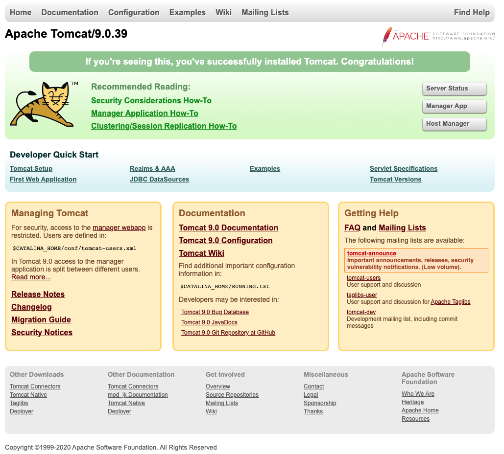
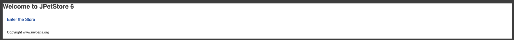
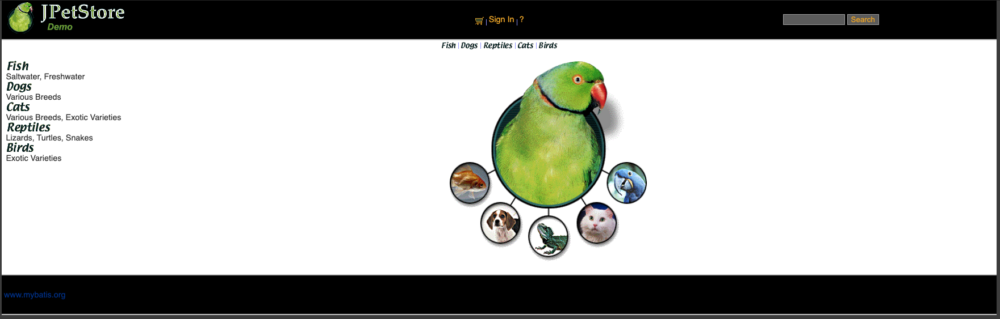
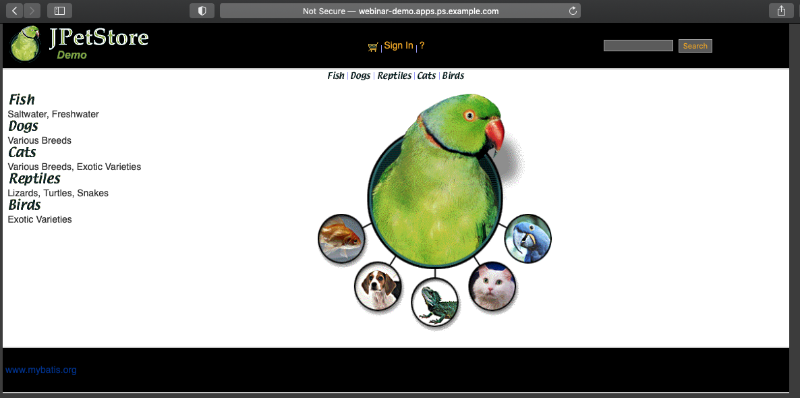

# Tomcat Docker 빌드

- [openjdk](https://hub.docker.com/_/openjdk) 1.8.0_272-b10
- [apache-tomcat](http://tomcat.apache.org/) 9.0.39
- [jpetsore](https://github.com/mybatis/jpetstore-6) 6

## 1. Docker 컨테이너 이미지 생성하기

### 1.1 Dockerfile 생성
> 오픈시프트에서 기동되는 컨테이너는 프로젝트별로 생성된 권한으로 기동 되기 때문에 읽기/쓰기가 가능해야 한다. 
- Tomcat 설정 파일의 그룹 권한을 읽기가 가능하도록 설정한다. (conf)
- Tomcat 에서 파일 쓰기가 필요한 디렉토리는 쓰기가 가능하도록 설정한다. (logs,temp,work,webapps)
- 기본적으로 1024 포트이하는 사용하지 못한다.

```
FROM openjdk:8

USER root
LABEL MAINTAINER="shkim@rockplace.co.kr"

ARG CATALINA_MAJOR_VER=9
ARG CATALINA_VERSION=9.0.39 
ENV CATALINA_HOME=/usr/local/apache-tomcat-${CATALINA_VERSION} \
    CATALINA_BASE=${CATALINA_HOME}

ADD https://downloads.apache.org/tomcat/tomcat-${CATALINA_MAJOR_VER}/v${CATALINA_VERSION}/bin/apache-tomcat-${CATALINA_VERSION}.tar.gz /usr/local

RUN cd /usr/local && tar -xf apache-tomcat-${CATALINA_VERSION}.tar.gz -C /usr/local && rm -f apache-tomcat-${CATALINA_VERSION}.tar.gz \
    && useradd -u 1000 -G root tomcat && chown -R tomcat:root ${CATALINA_HOME} \
    && chmod 750 $CATALINA_HOME/conf && chmod 640 $CATALINA_HOME/conf/* \  
    && chmod 777 $CATALINA_HOME/temp $CATALINA_HOME/work $CATALINA_HOME/logs $CATALINA_HOME/webapps 

ADD jpetstore.war $CATALINA_HOME/webapps/

WORKDIR $CATALINA_HOME

USER 1000

EXPOSE 8080
EXPOSE 8009 
 
ENTRYPOINT ["./bin/catalina.sh","run"]
```

### 1.2 Docker 빌드하기
```
#!/usr/bin/env bash
docker build -t rockplace/tomcat:9 .
```

### 1.3 Docker 컨테이너 실행하기
```
docker run --rm -p 8080:8080 rockplace/tomcat:9
```
### 1.4 Docker 컨테이너 실행 확인하기
```
http://localhost:8080
```


## 2. Spring 프레임워크 데모 빌드하기
```
git clone https://github.com/mybatis/jpetstore-6.git

docker run -v "${PWD}:/usr/app/myapp" -v "${PWD}/m2/:/root/.m2/" -w /usr/app/myapp maven:3-jdk-8 ./mvnw clean package
```

## 3. Spring 프래임워크 데모 Docker 컨테이너에 배포하기
### 3.1 빌드된 Spring 프레임워크 를 Tomcat 배포디렉토리로 복사
> jpetstore.war 파일을 docker 빌드 디렉토리로 복사후 진행
```
ADD jpetstore.war $CATALINA_HOME/webapps/
```
### 3.2 빌드가 불가능한 환경은 빌드된 버전을 다운로드
```
ADD https://github.com/nationminu/tomcat-docker-build-demo/blob/master/jpetstore.war $CATALINA_HOME/webapps/
```
### 3.2 변경된 내용을 적용하기 위해 Docker 빌드를 다시 실행
```
docker build -t rockplace/tomcat:9 .
```
### 3.3 Docker 컨테이너 실행하기
```
docker run --rm -p 8080:8080 rockplace/tomcat:9
```
### 3.4 Docker 컨테이너 실행 확인하기
```
http://localhost:8080/jpetstore
```



---
# 생성한 Docker 이미지를 오픈시프트에서 사용하기.
## 1. 오픈시프트 private registry 에 이미지를 push 한다.
```
# docker tag rockplace/tomcat:9 bastion.ps.example.com:5000/rockplace/tomcat:9
# docker push bastion.ps.example.com:5000/rockplace/tomcat:9
The push refers to repository [bastion.ps.example.com:5000/rockplace/tomcat]
1dc1c6e8e00e: Pushed
14adae7093b3: Pushed
...
9: digest: sha256:831993e955cb491d046bff0b1fb9c47a5d2a5a29668b216b76ae864dc20b5361 size: 2430

# curl -k https://bastion.ps.example.com:5000/v2/_catalog
{"repositories":["rockplace/tomcat",.... ]}
```

## 2. 오픈시프트에서 프로젝트 생성 후 이미지 스트림을 import 한다.
```
# oc new-project webinar-demo
# oc import-image tomcat:latest --from=bastion.ps.example.com:5000/rockplace/tomcat:9 --insecure --confirm
# oc get is 
NAME     IMAGE REPOSITORY                                                       TAGS     UPDATED
tomcat   image-registry.openshift-image-registry.svc:5000/webinar-demo/tomcat   latest   13 minutes ago
```

## 3. 이미지 스트림을 사용하여 어플리케이션 POD를 생성한다.
```
# oc new-app --image-stream=tomcat:latest
# oc get pod,svc
NAME                          READY   STATUS    RESTARTS   AGE
pod/tomcat-69c5bd6c85-ws4v4   1/1     Running   0          18m

NAME             TYPE        CLUSTER-IP     EXTERNAL-IP   PORT(S)             AGE
service/tomcat   ClusterIP   172.30.204.9   <none>        8009/TCP,8080/TCP   28m 
```


## 4. route 를 생성하고 브라우저로 접속을 확인하다.
```
# oc expose service tomcat --name=webinar-demo
# oc get route
NAME                 HOST/PORT                          PATH   SERVICES   PORT       TERMINATION   WILDCARD
webinar-demo-route   webinar-demo.apps.ps.example.com          tomcat     8080-tcp                 None
```

